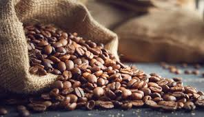

## Introduction 
The dataset is about coffee, giving information on Arabic and Robusta coffee beans.The information was collected by Sam Donald on
October 8th, 2022. It is part of the CORGIS dataset project. The data
set provides data on where it was harvested, the altitude, the year it
was collected, the processing method, the color of bean, the bags
produced, and how all of these factors ultimately affects the rating of
the coffee (which is our outcome variable of interest). I will be
exploring how the variables of the processing method, the bags produced,
and where the beans came from affect the overall rating of the beans. I chose these variables because I wanted to see if beans were truly better quality if made in small batches, if washed beans or dry beans were better, and how the altitude they are grown in affects the rating of the beans.

```{r setup, echo=FALSE}

knitr::opts_chunk$set(echo = FALSE)
Project1_coffee = read.csv("Project1_coffee.csv")
# I am reading the dataset file
```



#I'm pulling an image from my files to put here

Where do coffee beans come from?. Nescafé UK & IE. (n.d.).
<https://www.nescafe.com/gb/coffee-culture/knowledge/coffee-beans>

## 2. Outcome Variable

```{r, echo= FALSE}

library(ggplot2)

rating_plot = ggplot(Project1_coffee)

rating_plot + geom_histogram(aes(x =Rating), binwidth = 5, fill = "orange", col = "black") +   labs( x = "Rating", y = "Number of coffee bean breeds", title = "Distribution of Bean Ratings")
#I created a histogram that shows the distribution of bean ratings

```

The distribution of our outcome variable skews to the right, with the
average rating being `r round(mean(Project1_coffee$Rating), digits = 2)` and the median
rating being `r round(median(Project1_coffee$Rating), digits = 2)` 
.

## 3. Bivariate Analyses
```{r, echo=FALSE}


library(ggplot2)
rating_plot = ggplot(Project1_coffee)

Project1_coffee$ProcessingMethod <- factor( Project1_coffee$ProcessingMethod, levels = c("Washed / Wet", "Natural / Dry"))

rating_plot <- ggplot(Project1_coffee, aes(x = ProcessingMethod, y = (Rating), fill = ProcessingMethod))  + geom_bar(stat = "summary", fun = "mean") + labs(x = "Processing Method", y = "Rating",title = "Average Rating Based on Processing Method")

rating_plot
#I'm creating a bar graph to see the average rating of Washed/wet beans and Natural/Dry beans
```

The average for beans that were processed as "Washed/ Wet" have an average rating of  
`r wet_plot = Project1_coffee[Project1_coffee$ProcessingMethod == "Washed / Wet",]

round (mean(wet_plot$Rating), digits = 2)`
and the average for beans that were processed as "Natural/dry" was
`r dry_set = Project1_coffee[Project1_coffee$ProcessingMethod =="Natural / Dry",]
round(mean(dry_set$Rating), digits = 2)`
. The difference between the average ratings was .92 points out of 100, meaning that on average, natural/dry beans were rated 0.92% higher compared to washed/wet beans. This is ultimately not a significant enough difference to be able to declare that one processing method is considered better than another. The standard deviation for the natural beans is 
`r round (sd(wet_plot$Rating), digits = 2)`
and the standard deviation for washed beans is 
`r round (sd(dry_set$Rating), digits = 2)`
. This [link](https://backyardbeans.com/blogs/all/coffee-washed-vs-natural-process?srsltid=ARcRdnrZ3pz8aTED9gI9xLWEroH5kBC7TFNBZyfVhEzVGRxOZdcAstDc)
goes further into detail on what a dry or wet process looks like for beans and highlights the differences in flavor.

```{r, echo = FALSE}
library(ggplot2)
rating_plot = ggplot(Project1_coffee)
#Creating a ggplot for the next graph
Project1_coffee$Big_Batch = 1* (Project1_coffee$BagsProduced >250)
#Made a variable to define what a big batch is and what a small batch is.

Project1_coffee$Big_Batch <- factor( Project1_coffee$Big_Batch, levels = c(0, 1))
#Used factor function to turn big batch and small batch into categorical variables for the graph 
rating_plot <- ggplot(Project1_coffee, aes(x = Big_Batch, y = (Rating), fill = Big_Batch))  + geom_bar(stat = "summary", fun = "mean") + labs(x = "Batch Size (>250 bags = 1, else 0)", y = "Average Rating",title = "Average Rating Based on Batch Size")

rating_plot
## Created a bar graph to see if small batches are better on average or if big batches are.
```

To find if coffee was rated better when made in small batches or big batches, I created a variable that was 1 (representing a big batch) if it was above the median or 0 (representing a small batch) if it was below the median.I calculated the median of the batch sizes to be 
`r round (median(Project1_coffee$BagsProduced), digits = 0)`
.The average rating for beans that were produced in small batches is
`r small_set = Project1_coffee[Project1_coffee$Big_Batch == 0 ,]
round (mean(small_set$Rating), digits = 2)`
and the average rating for beans that were produced in big batches is 
`r big_set = Project1_coffee[Project1_coffee$Big_Batch == 1 ,]
round (mean(big_set$Rating), digits = 2)`
. Overall the difference in the average rating between the big batch and small batch is only about .12/100, with the small batch rating being slightly better. However, this is not a significant difference so it is hard to draw any clear conclusion about which type of batch size is better. The standard deviation of the small batches are 
`r round (sd(small_set$Rating), digits = 2)`
and the standard deviation of the big batches are
`r round (sd(big_set$Rating), digits = 2)`
.
```{r, echo = FALSE}
library(ggplot2)
rating_plot = ggplot(Project1_coffee)
# Made ggplot for the next graph
rating_plot <- ggplot(Project1_coffee, aes(x = Altitude, y = (Rating), ))  + geom_point(stat = "summary", fun = "mean") + labs(x = "Altitude (meters)", y = "Rating (out of 100)",title = "Average Rating Based on Altitude")
rating_plot
#Created a scatterplot with the x axis being altitude and the y axis being the average rating

```

Based on the scatterplot above, the coffee grown between 1500-2000 meters of altitude generally has a better rating than coffee grown outside of this range. The average rating for coffee that is grown in between 1500-2000 meters high is
`r ideal_range = Project1_coffee[Project1_coffee$Altitude > 1500 & Project1_coffee$Altitude < 2000 ,]
round (mean(ideal_range$Rating), digits = 2)`
while the average rating for coffee that is grown outside of this range is 
`r bad_range = Project1_coffee[Project1_coffee$Altitude < 1500 | Project1_coffee$Altitude > 2000 ,]
round (mean(bad_range$Rating), digits = 2)`
. The standard deviation of the 1500-2000 meter range is
`r round (sd(ideal_range$Rating), digits = 2)`
and the standard deviation deviation for outside that range is
`r round (sd(bad_range$Rating), digits = 2)`
. For more information on how altitude affects the flavor profile of coffee, click this [link.](https://espressooutlet.com/blogs/news/how-does-altitude-affect-coffee-taste?srsltid=AfmBOopUayadZ3onilXfA5MgrNubZlI1ogIDR3w-Ka900MctFGu_uNYl)

## 4. Choice Elements
I used in-line code for describing the statistics of the univariate distribution graph as well as all 3 bivariate distribution graphs. I included hyperlinks for explaining more about how altitude affects the taste of beans and hyperlinked an article that talked more in-depth about how the bean processing method affects flavor. I used subsetting to find the mean rating of different variables in all 3 of the bivariate graph analyses. I made the text red for my conclusion statements in the analyses. I created a new variable that represented a batch that was above the median to analyze if big batches or small batches would have better ratings.

## 5. Conclusion

In my project, I found that batch size didn't cause a significant difference in rating, although small batches had a slightly better rating on average compared to big batches. When it comes to processing methods, natural/dry beans had a slightly better rating on average but it was not a significantly better rating compared to washed/wet beans. As for altitude, I found that the range of 1500-2000 meters had a better average rating than altitudes that were outside of this range. In the future, I want to analyze how the region that the beans are grown in affect the rating and how bean color affects the rating as well.

## References

Where do coffee beans come from?. Nescafé UK & IE. (n.d.).
<https://www.nescafe.com/gb/coffee-culture/knowledge/coffee-beans>

Ellis, B. (2024, July 12). How does altitude affect coffee taste?. Espresso Outlet LLC. https://espressooutlet.com/blogs/news/how-does-altitude-affect-coffee-taste?srsltid=AfmBOopUayadZ3onilXfA5MgrNubZlI1ogIDR3w-Ka900MctFGu_uNYl 

Where do coffee beans come from?. Nescafé UK & IE. (n.d.). https://www.nescafe.com/gb/coffee-culture/knowledge/coffee-beans 


